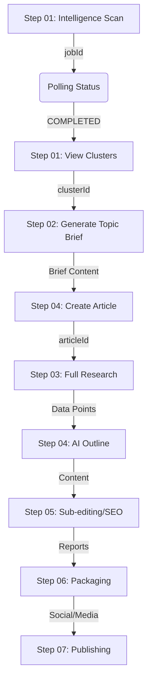

# Beyond Headlines Editorial API: Technical Integration Guide

This document is the definitive guide for frontend engineers to integrate with the Beyond Headlines Editorial Engine. It details the authentication handshake, the state-driven editorial lifecycle, and technical specifications for all core endpoints.

---

## 1. System Architecture & Authentication

### 🔐 The "Identity Handshake"
The API uses a stateless authentication model designed for secure service-to-service communication between the Laravel Editor Panel and the Editorial Engine.

**Every single request** must carry two specific credentials:

| Credential | Type | Placement | Value |
| :--- | :--- | :--- | :--- |
| **API Secret** | Header | `X-API-Token` | `beyond-headlines-secret-token-2024` |
| **User Email** | Payload | `email` (body or query) | Current Laravel User's Email |

---

## 2. The Editorial Workflow (7-Step Lifecycle)

The frontend should be structured as a multi-step pipeline. Each step feeds data into the next.



---

## 3. Detailed API Reference (All Modules)

### 📡 Step 01: Discovery & Intelligence

#### Trigger Discovery Scan
`POST /api/v1/intelligence/scan`
*   **Request Body**:
    ```json
    {
      "email": "user@example.com",
      "query": "Future of AI in Media",
      "timeframe": "last_24h"
    }
    ```
*   **Response**: `{"jobId": "discovery-uuid", "status": "QUEUED"}`

#### List Clusters
`GET /api/v1/clusters?email=user@example.com`
*   **Response**: 
    ```json
    [
      {
        "id": "uuid",
        "topic": "AI Ethics in Journalism",
        "summary": "Recent debates on AI authorship...",
        "category": "Technology",
        "isEmerging": true
      }
    ]
    ```

#### Manually Trigger Scraper
`POST /api/v1/scrape/trigger`
*   **Request Body**: `{"email": "admin@example.com", "query": "TechCrunch", "category": "Tech"}`
*   **Response**: `{"jobId": "scrape-uuid", "message": "Scrape job queued"}`

---

### 🧠 Step 02 & 03: Research & Briefing

#### Generate Topic Brief
`POST /api/v1/research/topic-brief`
*   **Request Body**: `{"email": "user@example.com", "clusterId": "uuid"}`
*   **Response**:
    ```json
    {
      "issue_summary": "Summary text...",
      "suggested_angles": [{"title": "Angle 1", "reasoning": "..."}],
      "key_questions": ["What...?", "How...?"],
      "stakeholders": [{"name": "Name", "role": "Role"}]
    }
    ```

#### Start Full Research (Perplexity)
`POST /api/v1/research/generate`
*   **Request Body**: `{"email": "user@example.com", "articleId": "uuid", "angle": "Specific Angle"}`
*   **Response**: `{"jobId": "res-uuid", "status": "QUEUED"}`

---

### ✍️ Step 04: Drafting & Editing

#### Create Article Draft
`POST /api/v1/articles`
*   **Request Body**: 
    ```json
    {
      "email": "user@example.com",
      "title": "My Story",
      "body": {"type": "doc", "content": []},
      "tone": "ANALYTICAL",
      "categoryId": "cat-uuid"
    }
    ```
*   **Response**: `{"id": "art-uuid", "slug": "my-story", "status": "DRAFT"}`

#### Generate Outline
`POST /api/v1/ai/outline`
*   **Request Body**: `{"email": "user@example.com", "articleId": "uuid", "tone": "EXPLANATORY"}`
*   **Response**: `{"outline": [{"title": "Intro", "points": ["..."]}]}`

#### Inline AI Assist
`POST /api/v1/ai/inline-assist`
*   **Request Body**: `{"email": "user@example.com", "articleId": "uuid", "paragraph": "Text to improve..."}`
*   **Response**: `{"revisedText": "Polished text..."}`

---

### 🔍 Step 05 & 06: Audit & Packaging

#### Sub-edit Audit
`POST /api/v1/ai/sub-edit`
*   **Request Body**: `{"email": "user@example.com", "articleId": "uuid"}`
*   **Response**: `{"audit": {"score": 85, "suggestions": ["..."]}}`

#### Headline Scoring
`POST /api/v1/ai/score-headlines`
*   **Request Body**: `{"email": "user@example.com", "headlines": ["H1", "H2"]}`
*   **Response**: `[{"headline": "H1", "score": 90, "critique": "..."}]`

#### Social Media Packaging
`POST /api/v1/ai/packaging`
*   **Request Body**: `{"email": "user@example.com", "articleId": "uuid"}`
*   **Response**: `{"social": {"twitter": "..."}, "image_concepts": ["..."]}`

---

### 🚀 Step 07: Publishing & Review

#### Submit for Review
`POST /api/v1/publish/:id/submit-review`
*   **Request Body**: `{"email": "user@example.com"}`
*   **Response**: `{"status": "PENDING_REVIEW"}`

#### Admin Approval & Publish
`POST /api/v1/publish/:id/approve`
*   **Request Body**: `{"email": "admin@example.com"}`
*   **Response**: `{"status": "PUBLISHED", "publishedAt": "..."}`

#### View Review Queue
`GET /api/v1/publish/queue?email=admin@example.com`
*   **Response**: `[{"id": "uuid", "title": "Article Title", "status": "PENDING_REVIEW"}]`

---

### 📂 Taxonomy & Admin

#### List Categories
`GET /api/v1/categories?email=user@example.com`
*   **Response**: `[{"id": "uuid", "name": "Technology", "slug": "tech"}]`

#### Manage Source Mappings
`GET /api/v1/admin/source-language-mappings?email=admin@example.com`
*   **Response**: `{"data": [{"source": "PROTHOM_ALO", "englishDomain": "en.prothomalo.com"}]}`

#### Analytics Overview
`GET /api/v1/analytics/overview?email=admin@example.com`
*   **Response**: `{"totalArticles": 150, "totalViews": 25000, "averageReadTime": "3m 12s"}`

---

## 4. Technical Specifications

### Data Formatting: The `Article.body`
The article body is stored as **JSON**. This is designed to work with block-based editors (TipTap/Editor.js).
*   **Do not** send large strings of raw HTML.
*   **Do** send structured JSON objects that represent the document tree.

### Polling & Resilience
Background jobs (`scan`, `research`) can take 30s to 2 minutes.
1.  Initiate Job → Get `jobId`.
2.  Poll `GET /intelligence/status/:id` or `GET /research/:articleId`.
3.  Handle timeouts gracefully by offering a "Retry" button.

### Error Codes Reference

| Code | Meaning | Solution |
| :--- | :--- | :--- |
| **401** | Unauthorized | Check if `X-API-Token` is in the headers. |
| **404** | Not Found | The `clusterId` or `articleId` provided is invalid. |
| **422** | Validation Error | Check the `details` field in the response for missing body fields. |
| **500** | Server Error | AI provider timeout or database deadlock. |

---

## 5. Deployment & Testing
*   **Swagger UI**: `http://localhost:8000/docs`
*   **Postman Collection**: `Beyond_Headlines_API_Postman_Collection.json`

---
*Document Version: 1.5.0*
*Last Updated: April 2024*
*Beyond Headlines Engineering Team*
